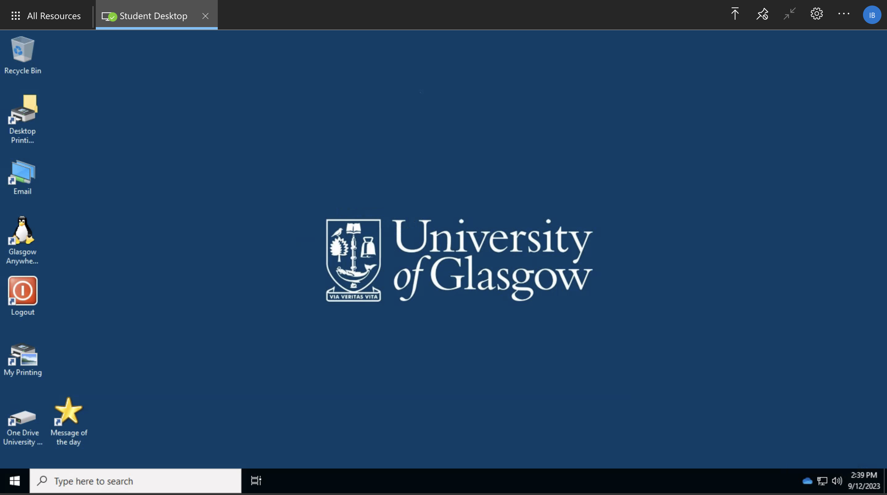
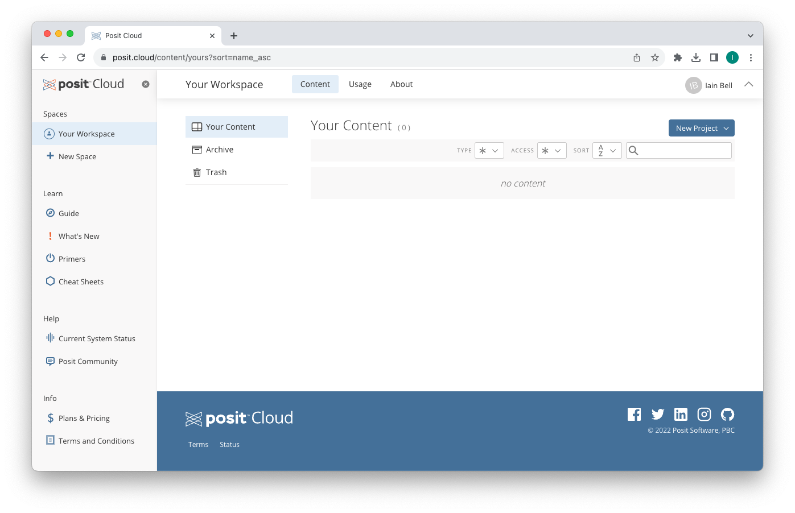

# Accessing RStudio Virtually {#virtual}

## Virtual Desktop

If you are unable to download and install RStudio on to your own device, don't worry! It is possible to access RStudio on the University's Virtual Desktop, called **Glasgow Anywhere Desktop**.

To do this, follow this [link](https://www.gla.ac.uk/myglasgow/anywhere/desktop/) and select the '*Connect to Glasgow Anywhere Desktop via your web browser*' link. You will need to log in using your student email and password and then select the '*Student Desktop*'. This will open a Windows desktop in your browser - the same one you would see on a PC in the computer labs.

```{r VDIimage, echo=FALSE, fig.cap="Glasgow Anywhere Student Desktop", fig.align="center", out.width='80%'}

```

Search for the **RStudio app** within this desktop and launch it. You will then be able to use RStudio in the same way as if it was installed on your own device.


## Posit Cloud

<!-- lectures only-->

[{width=40%}](https://posit.cloud/)

If you are using a **tablet**, you won't be able to install R and RStudio, however an alternative is to use [Posit Cloud](https://posit.cloud/). This allows you to use RStudio in a browser.

You can create a free account which allows you to use RStudio for 25 hours per month. Because of this limit, we recommend that you **only use Posit Cloud to follow along in lectures** - in the labs, you can use a lab PC.

To use RStudio in Posit Cloud, sign in to your account and navigate to the Posit Cloud page.

```{r Positimage, echo=FALSE, fig.cap="Posit Cloud Homepage", fig.align="center", out.width='90%'}

```

To start a new RStudio session, go to `New Project > New RStudio Project` which will open an RStudio window in your browser. This 'project' will be saved in "Your Workspace" so you can return to it for all the lectures.


