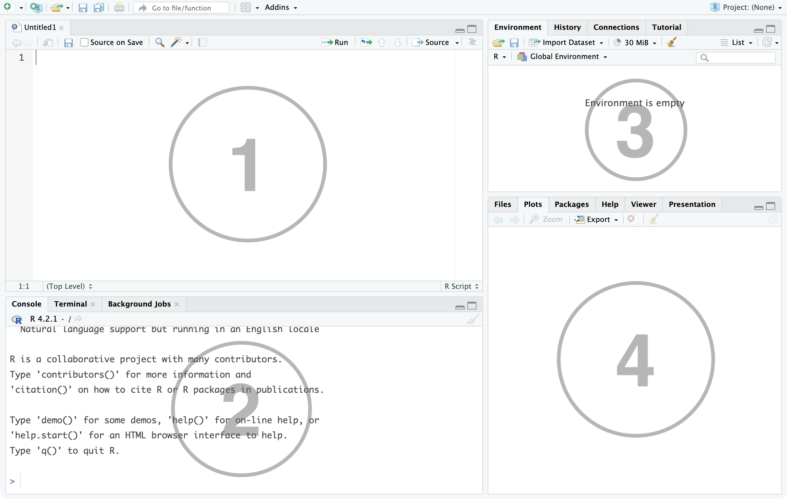

# Using RStudio {#UseR}

Open the RStudio app and create a new text file (called an "R script") by:

* clicking '{width=3%}' in the top left of the RStudio window
* selecting '{width=3%} R Script' from the drop down menu options

This will open a new pane in the RStudio window which is where you will write all of your code. RStudio is arranged with four panes, the default layout of which you can see below.

```{r rstud-image, echo=FALSE, fig.cap="RStudio window", fig.align="center"}

```

1. This is the **source pane**. This is where you will view, write and edit all your code and view data in a spreadsheet format. Typically this pane isn't displayed when you first launch RStudio; instead, you need to open a new (or pre-existing) R script or load in some data.
   
   We 'run' code from here by selecting the row(s) we want to execute and clicking the '{width=3%} Run' icon in the top right of this pane (alternatively hold the `ctrl` key (or `cmd` on Mac) and hit `enter` at the same time).
   
2. This is the **console pane**. This is where you can view the outcome of any code you have 'run', as well as type in commands and view output messages such as warnings or errors from code that doesn't work correctly.

3. This pane has several different tabs, but the most used one is the **Environment** tab. This lists some information about the 'objects' you have created in your code, such as data frames, vectors or statistical models which we'll learn more about throughout these labs.

4. This pane also has several tabs. The ones of note here are the **Files** tab which shows the folders and files the current RStudio session has access to; the **Plots** tab which shows any plots or graphs you have created in your code; and the **Help** tab which can be used to learn more about the properties of different functions that can be used in R Studio.


## Practise Code

To test that your RStudio is working as expected, copy and paste the following code to the R Script you have just created. You can then 'run' this code to see the result.

```{r, eval=FALSE}
(112/8)*0.5
```

You should see the value 7 pasted in the console pane.

It is also good to know that you can use "packages" in R. To install the package `ggplot2` on to your device, copy and paste the code below into your R script, then make sure to run these two lines.

```{r, eval=FALSE}
install.packages("ggplot2")
library(ggplot2)
```

The `ggplot2` package is used to create graphs and plots in R Studio. Again, copy and paste the code below then run it to see an example of a plot you can create in R. You don't need to understand any of this code at the moment, it will all be explained in your courses!

```{r, eval=FALSE}
ggplot(data = mtcars) +
  geom_boxplot(aes(x = as.factor(cyl), y = mpg), fill = "slateblue", alpha = 0.2) +
  xlab("cyl")
```

Now you should see the following plot in the plots tab.

```{r, echo=FALSE}
ggplot(data = mtcars) +
  geom_boxplot(aes(x = as.factor(cyl), y = mpg), fill = "slateblue", alpha = 0.2) +
  xlab("cyl")
```

To save an R script with any code you have written, simply click the '{width=3%}' icon at the top left of the source pane and choose where to save the file (make sure this is somewhere you can find it again!). R scripts are saved as .r files.

To open a previously saved R script, either click on the .r file in the folder you've saved it to, or within RStudio go to `File > Open File...` and choose the .r file from there.

Now that you have RStudio installed and know everything works as expected, you can run the following code to play a game of Wordle in the console pane!

```{r, eval=FALSE}
install.packages("wordler")
library(wordler)

play_wordler()
```


