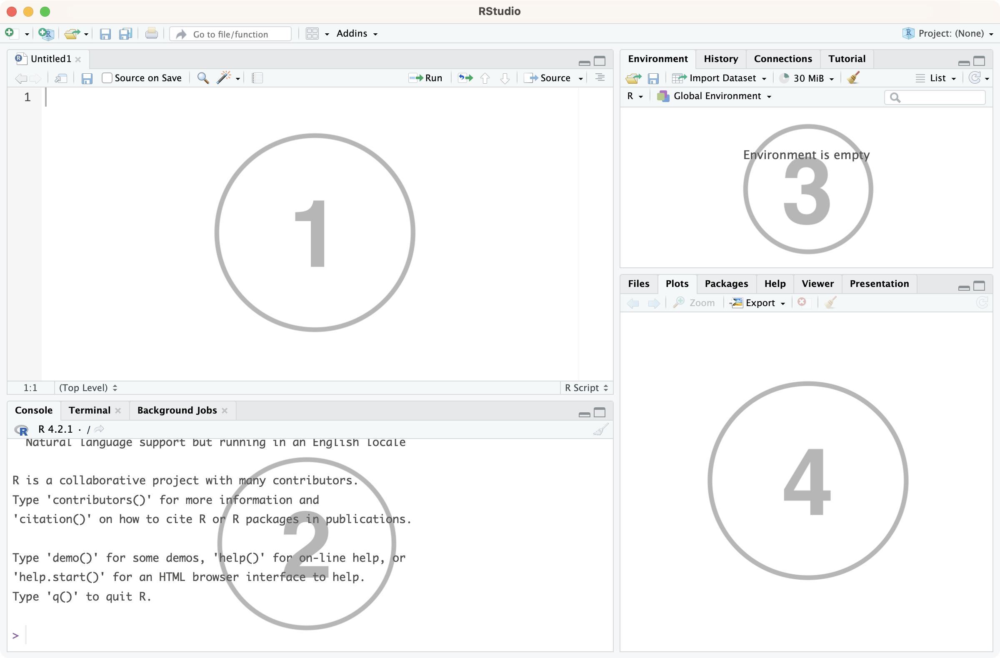

--- 
title: "S2S Lab 1"
site: bookdown::bookdown_site
output: bookdown::gitbook
documentclass: book
link-citations: yes
---

```{r setup, include=FALSE}
knitr::opts_chunk$set(echo=TRUE, eval=TRUE, comment=NA)
library(knitr)
library(webexercises)
```

<!--
# R and RStudio {#RStudio}

Welcome to the first S2S lab! The contents of these labs are based on the textbook [***Probability and Statistics with R***](https://read.kortext.com/reader/pdf/92741/A) by Ugarte, Militino and Arnholt. Reference will be made to this textbook throughout the labs and it's a great place to find further details and examples of the sort of things we'll be looking at. Note that everything you are expected to know will be covered in the labs themselves. 

Today you will be introduced to R and RStudio and learn how to use them both to define and manipulate your own vectors. 

[R](https://www.r-project.org/) is a programming language that you will use to write code in numerous statistics courses throughout your degree. [RStudio](https://posit.co/download/rstudio-desktop/) is an accompaniment to R, known as an Integrated Development Environment (IDE). RStudio essentially makes all features of the R programming language easier to use and it is the software you will interact with in these labs, rather than R directly.

It is best for you to install R and RStudio on your own device and use this for all of the labs, but if you would prefer, R and RStudio are always available from the desktop PCs in the lab.

If you do not already have R and RStudio downloaded on your device, follow the steps outlined below in Sections \@ref(downloadR) and \@ref(downloadRS) before moving on to Section \@ref(UseR) which will detail how to use RStudio.

## Installing R {#downloadR}

[{width=15%}](https://www.r-project.org/)

The first step is to install R onto your device. This can be done for free from [CRAN](https://cran.r-project.org/) (the **C**omprehensive **R** **A**rchive **N**etwork). R is available for Windows, Mac OS, Linux and some other less common operating systems.

* If you are using a Windows device, follow [this link](https://cran.r-project.org/bin/windows/base/) and click *'Download R-x.y.z for Windows'* to download the installer for the latest version of R. Once this is complete, run the installer and accept all default settings.
* If you are using a Mac, follow [this link](https://cran.r-project.org/bin/macosx/) and select the .pkg file from the left of the screen to download the installer for the latest version of R. Once this download is complete, open the file and complete the onscreen steps to finish installing R.

## Installing RStudio {#downloadRS}

[{width=40%}](https://posit.co/download/rstudio-desktop/)

Now that R is installed on your device, you are ready to download and install RStudio.

To do this, go to [RStudio](https://posit.co/download/rstudio-desktop/) and click on the link *'Download RStudio...'*. This should automatically detect what system your device is using but make sure to double check it says either for Windows or for MacOS - whichever is correct!

This file may take a while to download, but once it has launch the installer and follow the steps to complete the installation.

You are now ready to use RStudio. Make sure you launch the **RStudio app** to complete the labs, rather than R.

---

For more information on downloading, installing and using R and RStudio, see Sections [1.1 Introduction to **R**](https://read.kortext.com/reader/pdf/92741/1) and [1.2 Downloading and Installing **R**](https://read.kortext.com/reader/pdf/92741/1) in *Probability and Statistics with R*.


## Using RStudio {#UseR}

Once you have opened the RStudio app, create a new text file (called an "R script") by:

* clicking {width=5%} in the top left of the RStudio window
* selecting {width=12%} from the drop down menu options

This will open a new pane in the RStudio window which is where you will write all of your code. RStudio is arranged with four panes, the default layout of which you can see below.

```{r rstud-image, echo=FALSE, fig.cap="RStudio window", fig.align="center"}

```

1. This is the **source pane**. This is where you will view, write and edit all your code and view data in a spreadsheet format. Typically this pane isn't displayed when you first launch RStudio; instead, you need to open a new (or pre-existing) R script or load in some data.
   
   We 'run' code from here by selecting the row(s) we want to execute and clicking the {width=8%} icon in the top right of this pane (alternatively hold the `ctrl` key (or `cmd` on Mac) and hit `enter` at the same time).
   
2. This is the **console pane**. This is where you can view the outcome of any code you have 'run', as well as type in commands and view output messages such as warnings or errors from code that doesn't work correctly.

3. This pane has several different tabs, but the most used one is the **Environment** tab. This lists some information about the 'objects' you have created in your code, such as data frames, vectors or statistical models which we'll learn more about throughout these labs.

4. This pane also has several tabs. The ones of note here are the **Files** tab which shows the folders and files the current RStudio session has access to; the **Plots** tab which shows any plots or graphs you have created in your code; and the **Help** tab which can be used to learn more about the properties of different functions that can be used in R Studio.

To save an R script with any code you have written, simply click the {width=3%} icon at the top left of the source pane and choose where to save the file (make sure this is somewhere you can find it again, like in a folder called '*S2S Labs*'!). R scripts are saved as .r files.

To open a previously saved R script, either click on the .r file in the folder you've saved it to, or within RStudio go to `File > Open File...` and choose the .r file from there.

Now you are ready to begin using RStudio to write your own code!

---

You can read more about using RStudio in [Section 1.7 RStudio](https://read.kortext.com/reader/pdf/92741/16) of *Probability and Statistics with R*.
-->

# Welcome to S2S Labs


Welcome to the first S2S lab! The contents of these labs are based on the textbook [***Probability and Statistics with R***](https://read.kortext.com/reader/pdf/92741/A) by Ugarte, Militino and Arnholt. Reference will be made to this textbook throughout the labs and it's a great place to find further details and examples of the sort of things we'll be looking at.

```{r PASWR2-image, echo=FALSE, fig.align='center', out.width='40%'}
include_graphics("Images/PASWR2.png")
```

Over the course of the semester, we will have 10 lab slots - one every week on a Wednesday. The labs offer an opportunity to practise using RStudio yourself and follow along with the code being demonstrated. After all lab sessions have occurred each week, a complete version of that week's lab, showing solutions to all the tasks as well as separate solutions to the Further Exercises, will be made available on the [S2S Moodle page](https://moodle.gla.ac.uk/course/view.php?id=38593).

The first three weeks of labs will follow [Chapter 1 What Is R?](https://read.kortext.com/reader/pdf/92741/1) of *Probability and Statistics with R* and provide an introduction to the basics of using R to work with data. You can use this chapter to find extra details of what's covered in the first three labs but everything that is examinable will be covered in the labs themselves.

There are two pieces of assessment associated with these labs; an R assessment and a Lab Report. More details of these will be provided closer to the time.

## Mentimeter

[{width=60%}](https://www.menti.com/)

Throughout the lab, there will be some interactive questions. We will use Mentimeter to gather the class' answers. The solutions to all these questions will be available in the complete version of the lab, released later.

To access the Mentimeter for Lab 1, click on the logo above to head to [menti.com](https://www.menti.com/).


