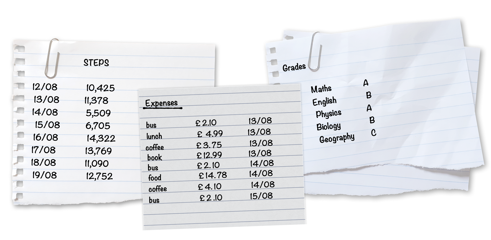

```{r setup, include=FALSE}
knitr::opts_chunk$set(echo = TRUE, eval=FALSE, comment=NA)
library(PASWR2)
library(knitr)
```

# Exercise 1

Table \ref{tab:temptable} below shows the annual mean temperature (in degrees Celsius) at 4 different locations along the River Dee for each year from 2015 to 2021. These data have been collected under the Scotland River Temperature Monitoring Network (SRTMN) project.

```{r, echo=FALSE, eval=TRUE}
temp.data <- c(NA,6.83,7.01,7.03,6.88,7.06,7.28,5.79,6.00,6.25,6.23,6.13,6.25,6.48,5.77,6.28,6.53,6.81,6.36,6.55,6.59,6.14,6.65,6.83,7.07,6.58,6.86,6.92)
years <- c("2015", "2016", "2017", "2018", "2019", "2020", "2021")
sites <- c("Site 1", "Site 2", "Site 3", "Site 4")

temp.table <- matrix(temp.data, ncol=7, byrow=TRUE)
dimnames(temp.table) <- list(sites, years)

# https://data.marine.gov.scot/dataset/scotland-river-temperature-monitoring-network-summary-data-0
```

```{r temptable, echo=FALSE, eval=TRUE}
library(knitr)
kable(temp.table, caption="\\label{tab:temptable}Recorded annual mean temperatures across the River Dee in the years 2015 to 2021")
```

Use either the `array()` or `matrix()` function to save these data in a matrix called `temps`. Make sure to rename the rows and columns of this matrix so they match what is shown in Table \ref{tab:temptable}.

Calculate the mean of all the temperatures from Site 3 across all seven years.

Calculate the mean of the temperatures across all four sites in 2015.

## Solution

```{r, eval=TRUE}
data <- c(NA,6.83,7.01,7.03,6.88,7.06,7.28,
          5.79,6.00,6.25,6.23,6.13,6.25,6.48,
          5.77,6.28,6.53,6.81,6.36,6.55,6.59,
          6.14,6.65,6.83,7.07,6.58,6.86,6.92)

temps <- array(data = data, dim = c(4, 7))
temps <- matrix(data = data, nrow = 4, byrow = TRUE)

years <- c("2015", "2016", "2017", "2018", "2019", "2020", "2021")
sites <- c("Site 1", "Site 2", "Site 3", "Site 4")

dimnames(temps) <- list(sites, years)
temps
```

```{r, eval=TRUE}
apply(X = temps, MARGIN = 1, FUN = mean)[3]
```

```{r, eval=TRUE}
apply(X = temps, MARGIN = 2, FUN = mean, na.rm=TRUE)[1]
```

# Exercise 2

Make sure the package `PASWR2` is installed and loaded in your current RStudio session. From this package, save the data frame `SWIMTIMES` into your **Environment** tab. This data set gives the improvement time (in seconds) for 28 swimmers who were randomly assigned to one of two different diets (see more by running the code `help("SWIMTIMES")`).

Explore the structure of the variables of this data set and change the labels for the levels of the factor `diet` to be `high` and `low`.

What is the mean improvement time for swimmers who were on a high fat diet?

## Solution

```{r}
install.packages("PASWR2")
library(PASWR2)

data("SWIMTIMES")
str(SWIMTIMES)

levels(SWIMTIMES$diet) <- c("high", "low")

mean(subset(x = SWIMTIMES$seconds, subset = (SWIMTIMES$diet == "high")))
```

```{r, echo=FALSE, eval=TRUE}
data("SWIMTIMES")

levels(SWIMTIMES$diet) <- c("high", "low")

mean(subset(x = SWIMTIMES$seconds, subset = (SWIMTIMES$diet == "high")))
```

\newpage

# Exercise 3

Mercedes has decided to keep track of different aspects of their life. Below are their notes recording their daily steps, some of their expenses and their most recent exam results.

```{r, eval=TRUE, echo=FALSE, fig.pos="H"}

```


Create three separate data frames, one for each of these notes, that stores the information shown above. Call them `steps`, `expenses` and `grades` respectively.

Then, combine these data frames into a single list so that Mercedes can easily continue to track these parts of their life.

Can you write code to show only the expenses from 14/08, using the list you have created?


## Solution

```{r, eval=TRUE}
#steps data frame
steps.dates <- c("12/08", "13/08", "14/08", "15/08", "16/08", "17/08", "18/08", "19/08")
steps.data <- c(10425, 11378, 5509, 6705, 14322, 13769, 11090, 12572)
steps <- data.frame(date = steps.dates, steps = steps.data)

#expenses data frame
exp.dates <- c("13/08", "13/08", "13/08", "13/08", "14/08", "14/08", "14/08", "15/08")
exp.description <- c("bus", "lunch", "coffee", "book", "bus", "food", "coffee", "bus")
exp.data <- c(2.10, 4.99, 3.75, 12.99, 2.10, 14.78, 4.10, 2.10)
expenses <- data.frame(date = exp.dates, description = exp.description, cost = exp.data)

#grades data frame
subject <- c("Maths", "English", "Physics", "Biology", "Geography")
grade <- c("A", "B", "A", "B", "C")
grades <- data.frame(subject, grade)

#list
mercedes <- list(steps = steps,
                 expenses = expenses,
                 grades = grades)

mercedes[["expenses"]][mercedes$expenses$date == "14/08", ]
```


