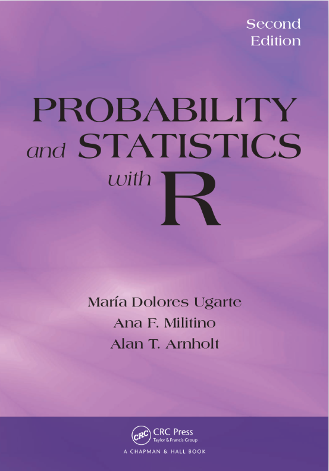

--- 
title: "S2S Lecture 1"
site: bookdown::bookdown_site
output: bookdown::gitbook
documentclass: book
link-citations: yes
---

```{r setup, include=FALSE}
knitr::opts_chunk$set(echo=TRUE, eval=TRUE, comment=NA)
library(knitr)
library(webexercises)
```

# Welcome to S2S Lectures

The lectures will cover material from the textbook [***Probability and Statistics with R***](https://read.kortext.com/reader/pdf/92741/A) by Ugarte, Militino and Arnholt. 

```{r PASWR2-image, echo=FALSE, fig.align='center', out.width='40%'}

```

* Be sure to do the pre-lecture reading for each lecture to get the most out of the lectures.
* It the pre-lecture reading material that's examinable, not just the lecture material
* Post questions in advance that you'd like answered in the lecture in ["Your questions for lectures"](https://moodle.gla.ac.uk/mod/feedback/view.php?id=4075572) on Moodle.
<!-- * All the pre-lecture reading and links are on [S2S Moodle page](https://moodle.gla.ac.uk/course/view.php?id=38593). -->
<!-- * We may use Mentimeter to gather class responses during lectures via [menti.com](https://www.menti.com/). -->

The first lecture covers material from [Chapter 2 Exploring Data](https://read.kortext.com/reader/pdf/92741/97) and **before** the lecture you should read:

* [2.1 What Is Statistics?](https://read.kortext.com/reader/pdf/92741/97)
* [2.2 Data](https://read.kortext.com/reader/pdf/92741/97)
* [2.5 Summary Measures of Location](https://read.kortext.com/reader/pdf/92741/120)
* [2.6.1-2.6.3 Summary Measures of Spread](https://read.kortext.com/reader/pdf/92741/129)

