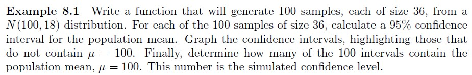

# Example 8-1 {-}

```{r, eval=TRUE, echo=FALSE, fig.align='center', out.width='100%'}

```

Use R, either via RStudio on your own device or this [online console](https://www.mycompiler.io/new/r).


```{r}
# This code answers the question - copy, paste and execute it in R...

norsim <- function(sims = 100, n = 36, mu = 100, sigma = 18, conf.level = 0.95) { 
    alpha <- 1 - conf.level 
    CL <- conf.level * 100
    ll <- numeric(sims)
    ul <- numeric(sims) 
    for (i in 1:sims) { 
      xbar <- mean(rnorm(n, mu, sigma))
      ll[i] <- xbar - qnorm(1 - alpha/2) * sigma/sqrt(n)
      ul[i] <- xbar + qnorm(1 - alpha/2) * sigma/sqrt(n)
      }
    notin <- sum((ll > mu) + (ul < mu))
    percentage <- round((notin/sims) * 100, 2)
    SCL <- 100 - percentage
    plot(ll, type = "n", ylim = c(min(ll), max(ul)), xlab = " ", ylab = " ")
    for (i in 1:sims) { 
      low <- ll[i]
      high <- ul[i]
      if (low < mu & high > mu) { 
        segments(i, low, i, high)
        } else if (low > mu & high > mu) { 
          segments(i, low, i, high, col = "red", lwd = 5)
          } else { 
            segments(i, low, i, high, col = "blue", lwd = 5)
          } 
      } 
    abline(h = mu)
    cat(SCL, "% of the random confidence intervals contain Mu =", mu, "\n")
    }

set.seed(10)
norsim(sims = 100, n = 36, mu = 100, sigma = 18, conf.level = 0.95)
```


`r hide("Execute the code")`
```{r, echo=FALSE, eval=TRUE, message=FALSE, warning=FALSE}
norsim <- function(sims = 100, n = 36, mu = 100, sigma = 18, conf.level = 0.95) { 
    alpha <- 1 - conf.level 
    CL <- conf.level * 100
    ll <- numeric(sims)
    ul <- numeric(sims) 
    for (i in 1:sims) { 
      xbar <- mean(rnorm(n, mu, sigma))
      ll[i] <- xbar - qnorm(1 - alpha/2) * sigma/sqrt(n)
      ul[i] <- xbar + qnorm(1 - alpha/2) * sigma/sqrt(n)
      }
    notin <- sum((ll > mu) + (ul < mu))
    percentage <- round((notin/sims) * 100, 2)
    SCL <- 100 - percentage
    plot(ll, type = "n", ylim = c(min(ll), max(ul)), xlab = " ", ylab = " ")
    for (i in 1:sims) { 
      low <- ll[i]
      high <- ul[i]
      if (low < mu & high > mu) { 
        segments(i, low, i, high)
        } else if (low > mu & high > mu) { 
          segments(i, low, i, high, col = "red", lwd = 5)
          } else { 
            segments(i, low, i, high, col = "blue", lwd = 5)
          } 
      } 
    abline(h = mu)
    cat(SCL, "% of the random confidence intervals contain Mu =", mu, "\n")
    }

set.seed(10)
norsim(sims = 100, n = 36, mu = 100, sigma = 18, conf.level = 0.95)

```
`r unhide()`
