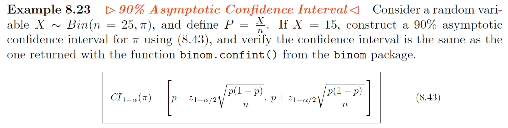

# Example 8-23 {-}

```{r, eval=TRUE, echo=FALSE, fig.align='center', out.width='100%'}

```

Use R, either via RStudio on your own device or this [online console](https://www.mycompiler.io/new/r).


```{r}
# These functions may be useful

qnorm()

library(binom)
binom.confint()
```


`r hide("Solution")`
```{r, echo=TRUE, eval=TRUE, message=FALSE, warning=FALSE}
# R Code 8.17
n <- 25
p <- 15/n # sample proportion
alpha <- 0.10 # alpha level
z <- qnorm(1 - alpha/2) # critical value
me <- z*sqrt(p*(1 - p)/n) # margin of error
CI <- p + c(-1, 1)*me
CI

library(binom)
binom.confint(x = 15, n = 25, conf.level = 0.90, methods = "asymptotic")
  
# For full solutions see textbook/lecture slides
```
`r unhide()`
