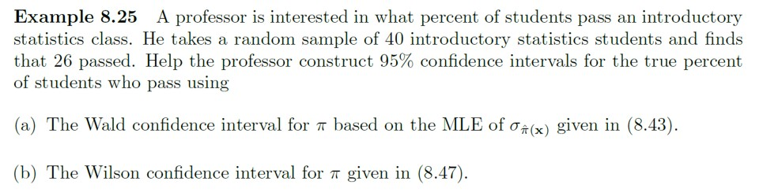

# Example 8-25 {-}

```{r, eval=TRUE, echo=FALSE, fig.align='center', out.width='100%'}

```

Use R, either via RStudio on your own device or this [online console](https://www.mycompiler.io/new/r).


```{r}
# These functions may be useful
library(binom)
binom.confint(x = , n = , conf.level = , methods = "asymptotic")
binom.confint(x = , n = , conf.level = , methods = "wilson")

prop.test(x = , n = , correct = FALSE, conf.level = )$conf

```


`r hide("Solution")`
```{r, echo=TRUE, eval=TRUE, message=FALSE, warning=FALSE}
#(a) The Wald 95% confidence interval
#R Code 8.21
n <- 40
x <- 26
p <- x/n # sample proportion passing
z <- qnorm(0.975) # critical value

n <- 40
CI <- p + c(-1, 1)*z*sqrt(p*(1 - p)/n)
CI

# Or
library(binom)
binom.confint(x = 26, n = 40, conf.level = 0.95, methods = "asymptotic")

#(b) The Wilson 95% confidence interval
#R Code 8.22
prop.test(x = 26, n = 40, correct = FALSE, conf.level = 0.95)$conf

# Or
binom.confint(x = 26, n = 40, conf.level = 0.95, methods = "wilson")

# For full solutions see textbook/lecture slides
```
`r unhide()`
