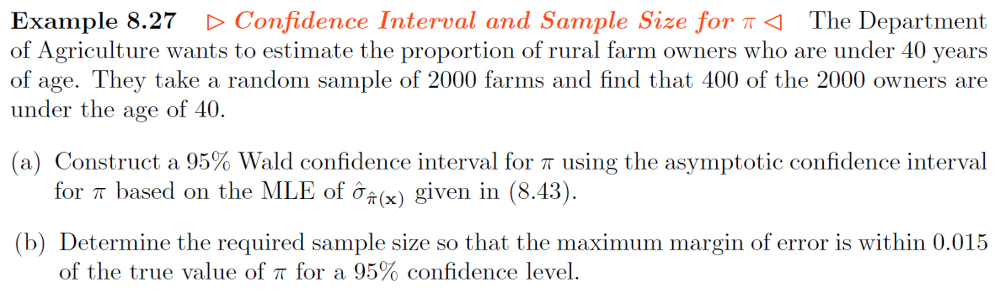

# Example 8-27 {-}

```{r, eval=TRUE, echo=FALSE, fig.align='center', out.width='100%'}

```

Use R, either via RStudio on your own device or this [online console](https://www.mycompiler.io/new/r).


```{r}
# These functions may be useful
library(binom)
binom.confint(x = , n = , conf.level = , methods = "asymptotic")

```


`r hide("Solution")`
```{r, echo=TRUE, eval=TRUE, message=FALSE, warning=FALSE}
#(a) Construct a 95% Wald confidence interval

x <- 400
n <- 2000
p <- x/n
z <- qnorm(0.975) # z_{0.975} 
CI <- p + c(-1, 1)*z*sqrt(p*(1 - p)/n)
CI

# Or
binom.confint(x = 400, n = 2000, conf = 0.95, methods = "asymptotic")

#(b) Determine the required sample size so that the maximum margin of error is within 0.015

f <- function(x){sqrt(x*(1 - x))} # x takes place of p in f
curve(expr = f, from = 0, to = 1, n = 500)

n <- 0.5*0.5*1.96^2/0.015^2
ceiling(n)

# For full solutions see textbook/lecture slides
```
`r unhide()`
