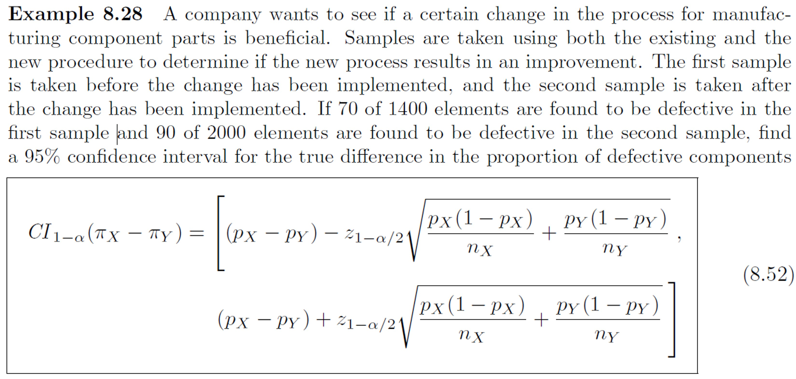

# Example 8-28 {-}

```{r, eval=TRUE, echo=FALSE, fig.align='center', out.width='100%'}

```

Use R, either via RStudio on your own device or this [online console](https://www.mycompiler.io/new/r).


```{r}
# This function may be useful

prop.test(x = c(_, _), n = c(_, _), conf.level = 0.95, correct = _)$conf

```


`r hide("Solution")`
```{r, echo=TRUE, eval=TRUE, message=FALSE, warning=FALSE}

# Without continuity correction...

prop.test(x = c(70, 90), n = c(1400, 2000), conf.level = 0.95, correct = FALSE)$conf

# With continuity correction...

prop.test(x = c(70, 90), n = c(1400, 2000), conf.level = 0.95, correct = TRUE)$conf

# For full solutions see textbook/lecture slides
```
`r unhide()`
