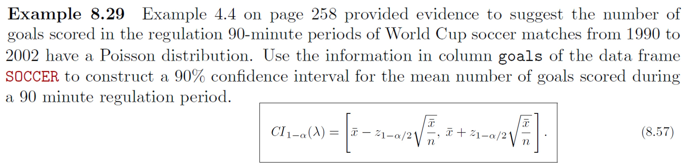

# Example 8-29 {-}

```{r, eval=TRUE, echo=FALSE, fig.align='center', out.width='100%'}

```

Use R, either via RStudio on your own device or this [online console](https://www.mycompiler.io/new/r).


```{r}
# These functions may be useful
library(PASWR2)
sum(!is.na())
mean(_, na.rm = TRUE)
qnorm()

```


`r hide("Solution")`
```{r, echo=TRUE, eval=TRUE, message=FALSE, warning=FALSE}

# R Code 8.27
library(PASWR2)
n <- sum(!is.na(SOCCER$game)) # number of games
xbar <- mean(SOCCER$goals, na.rm = TRUE)
z <- qnorm(0.95) # z_{0.95}
CI <- xbar + c(-1, 1) * z * sqrt(xbar/n)
CI

# For full solutions see textbook/lecture slides
```
`r unhide()`
