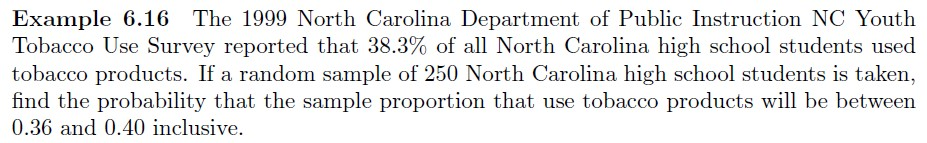

# Example 6-16 {-}

```{r, eval=TRUE, echo=FALSE, fig.align='center', out.width='100%'}

```

Using R, either via RStudio on your own device or this [online console](https://www.mycompiler.io/new/r), answer these questions using an approximation from the Normal distribution **with a continuity correction** and an exactly.


```{r}
# This code may be useful (you need to replace the _ with numerical expressions)

sig <- sqrt((_ * _)/_)

pnorm(_, _, sig) - pnorm(_, _, sig)

pbinom(_, _, _) - pbinom(_, _, _)

```


`r hide("Show the solution")`
```{r, echo=TRUE, eval=TRUE, message=FALSE, warning=FALSE}
# Approximately with continuity correction

sig <- sqrt((0.383 * 0.617)/250)

pnorm(0.402, 0.383, sig) - pnorm(0.358, 0.383, sig)

# Exactly

pbinom(100, 250, 0.383) - pbinom(89, 250, 0.383)

# See lecture slides or textbook for full solution

```
`r unhide()`

