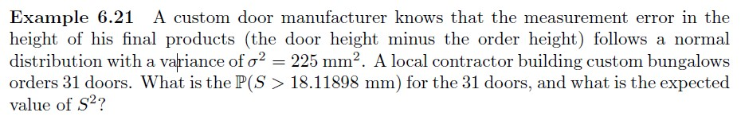

# Example 6-21 {-}

```{r, eval=TRUE, echo=FALSE, fig.align='center', out.width='100%'}

```

Use R, either via RStudio on your own device or this [online console](https://www.mycompiler.io/new/r).

```{r}
# These functions may be useful (you need to replace the _ with numerical expressions)

pchisq(_,_)
  
qchisq(_,_)
  
```


`r hide("Show the solution")`
```{r, echo=TRUE, eval=TRUE, message=FALSE, warning=FALSE}
pchisq(30 * (18.11898^2)/225, 30, lower = FALSE)

# See lecture slides or textbook for full solution

```
`r unhide()`

